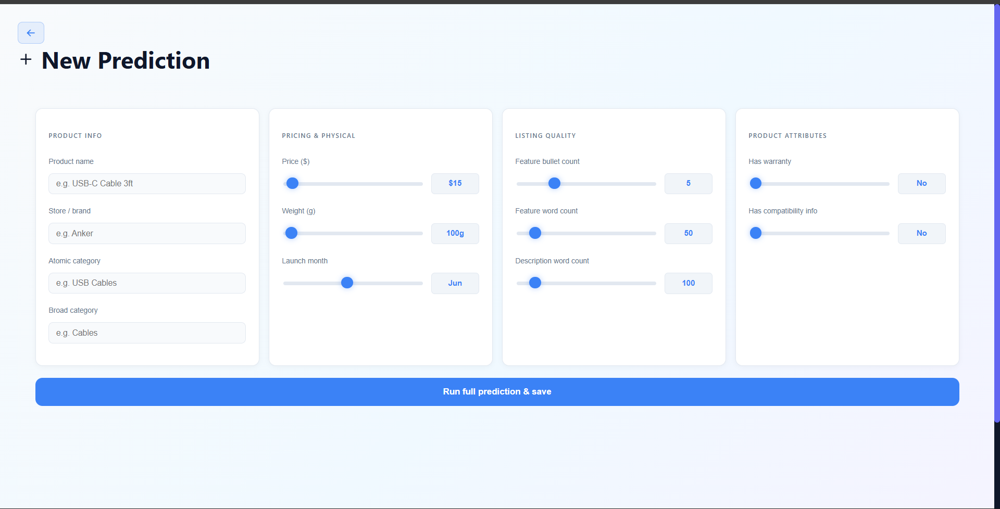
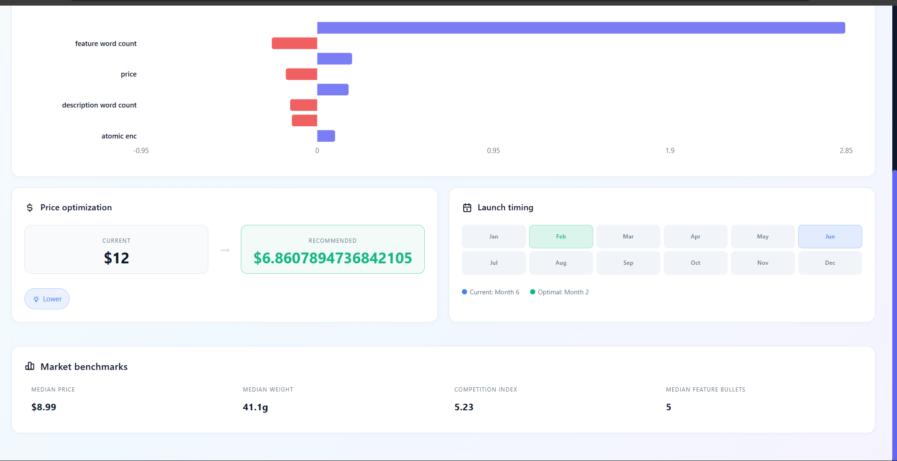
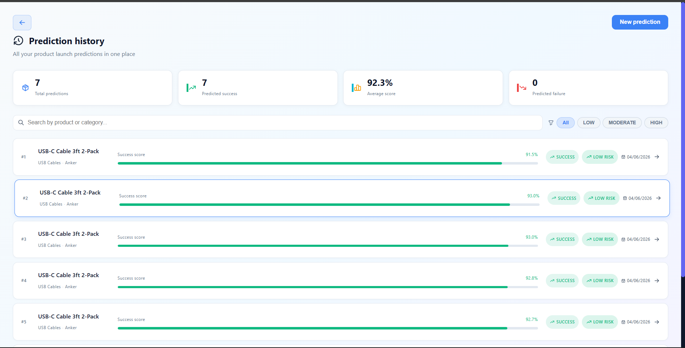
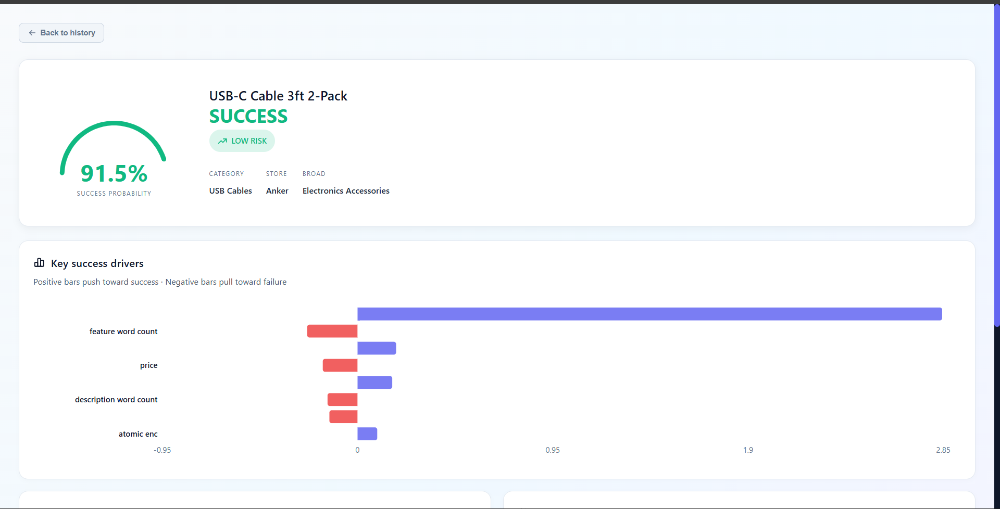

# 🚀 LaunchIQ – AI-Powered Product Launch Decision Intelligence Platform

LaunchIQ is an AI-powered web application that predicts the success probability of a product **before launch** using machine learning. The platform provides explainable predictions, category-based benchmarking, and optimization recommendations to support data-driven product launch decisions.

---

## ✨ Features

- 🤖 Predict product launch success using Machine Learning
- 📊 Success Probability Score with Risk Level
- 🔍 Explainable AI using SHAP
- 📈 Interactive dashboard with prediction history
- 📦 Category-based product benchmarking
- 💡 Product optimization recommendations
- 🔐 Secure user authentication
- 💾 Prediction history stored in PostgreSQL

---

## 🛠️ Tech Stack

### Frontend
- React.js
- Vite
- React Router
- Axios
- Recharts
- CSS

### Backend
- FastAPI
- SQLAlchemy
- PostgreSQL
- JWT Authentication
- Uvicorn

### Machine Learning
- Python
- Scikit-learn
- XGBoost
- Random Forest
- Gradient Boosting
- SHAP
- Pandas
- NumPy

---

## 📊 Machine Learning Pipeline

- Data Collection & Cleaning
- Feature Engineering
- Success Label Generation
- Model Training
- Ensemble Prediction
- SHAP Explainability
- Product Optimization
- Dashboard Visualization

---

## 📂 Dataset

- **Source:** Amazon Reviews 2023 Dataset (McAuley Lab)
- **Products:** ~12,000
- **Reviews:** ~65,000
- **Categories:** 280+
- **Engineered Features:** 31

---

## 📈 Model Performance

| Metric | Score |
|--------|-------|
| Test AUC | **0.88** |
| Accuracy | **86%** |
| Precision | **0.84** |
| Recall | **0.83** |
| F1 Score | **0.83** |

---

# 📸 Screenshots

## Landing Page


---

## Product Prediction



---

## Prediction Result



---

## Prediction History



---

## Dashboard



---

## 🚀 Getting Started

### Clone the repository

```bash
git clone https://github.com/motorola128/LaunchIQ.git
```

### Backend

```bash
cd backend

pip install -r requirements.txt

uvicorn main:app --reload
```

### Frontend

```bash
cd frontend

npm install

npm run dev
```

---

## 📁 Project Structure

```
LaunchIQ
│
├── backend
│
├── frontend
│
├── screenshots
│
├── google colab Notebooks
│
└── README.md
```

---

## 🎯 Skills Demonstrated

- Machine Learning
- Predictive Analytics
- Explainable AI (SHAP)
- Feature Engineering
- Data Cleaning
- PostgreSQL
- FastAPI
- React.js
- REST API Development
- Data Visualization
- Full Stack Development

---

## 🔮 Future Enhancements

- Real-time product monitoring
- Sales forecasting
- Competitor analysis
- Recommendation engine
- Cloud deployment

---
